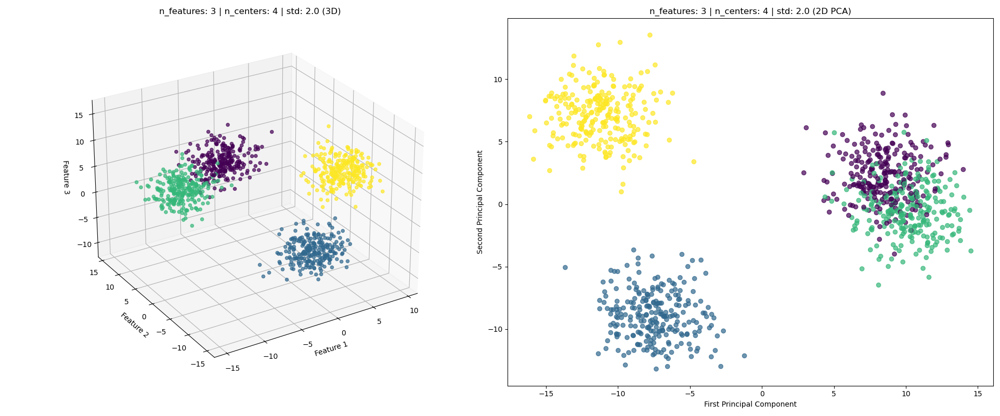
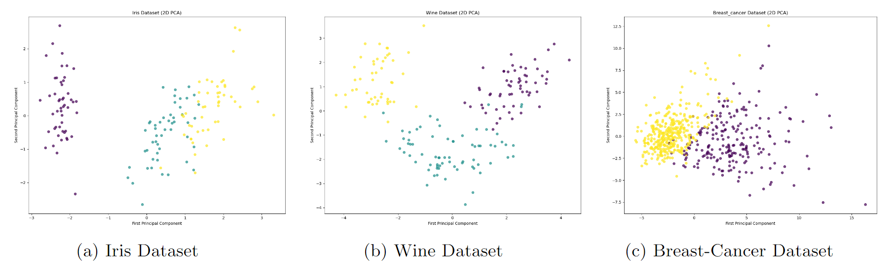

# Clustering-Framework

# Introduction
To examine different clustering algorithms a designated framework was created. This framework includes dataset generation used as a benchmark, clustering algorithms implementations of GMM with initial methods, UOFC with variety of criteria, and Heirarchical Clustering with different distance metrics. Overall, the dataset contains 219 examples and consists of Gaussian and non-Gaussian examples.

# Instructions
## Requirments
First, clone the clustering_framework code provided here.
```
clone https://github.com/NadavSc/Clustering-Framework.git
```
Then, create an anaconda environment (python 3.8):
```
conda create -n clustering python=3.8
```
Then, activate your environment:
```
conda activate <env_name>
```
Install the required packages:
* pandas
* scikit-learn
* matplotlib
* seaborn

## Running
### Configuration
In the main file:
1. Choose algorithms for running:
```
algorithms = ['gmm', 'uofc', 'hc']
```

2. Choose verbosity level:
  * verbosity 0 - no prints at all.
  * verbosity 1 - print information about the examples.
  * verbosity 2 - plot the results.

3. Make sure the savein path is correct:
```
    with open('data/dataset.json', 'r') as openfile:
        dataset = json.load(openfile)
```

### Scripts
There are several scripts:
1. **main.py** - the script for running the different algorithms and saving the results.
2. **dataset.py** - generates the different datasets (Gaussian/non-Gaussian/Unique examples)
3. **run_unique.py** - running the algorithms on the unique dataset.


# Data
The data that was generated consists of Gaussian, non-Gaussian, and unique examples.
Unique examples are various shapes. All of the above can be generate in the script data.py. 
We use PCA to visualize examples with more than three dimensions.
## 3D Gaussian Example

## Real non-Gaussian Examples

